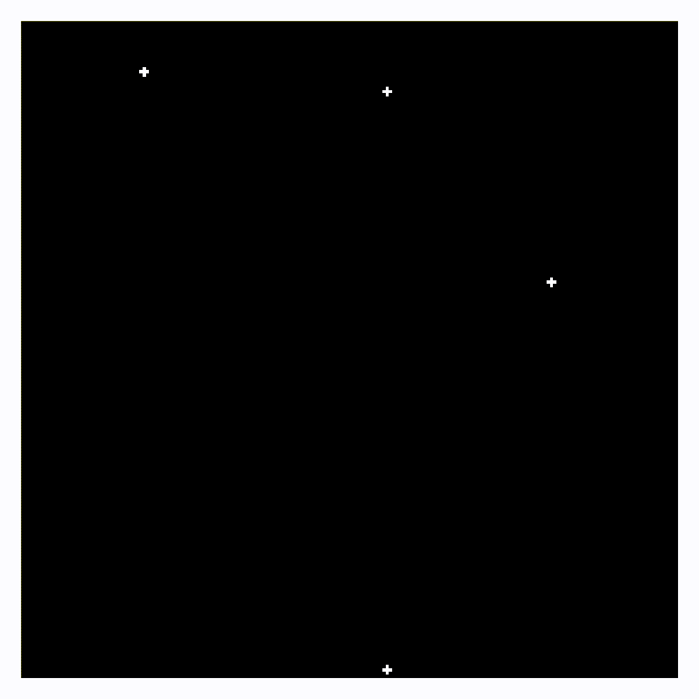

# Classical N-Body Simulation
This repository hosts the code for an enhanced N-Body Simulation. Drawing inspiration from the [gevolution-code](https://github.com/gevolution-code/gevolution-1.2) which supported my bachelor's thesis, this project employs the leapfrog integration method to compute the phase space of particles.

In particular the leapfrog integration can be used [[1]](https://en.wikipedia.org/wiki/Leapfrog_integration) when 

$\ddot{x}=A(x) $

The velocity and position are updated as follows

$a_i = A(x_i),$

$v_{i+1/2}=v_{i-1/2}+a_i \Delta t,$

$x_{i}=v_{i-1}+v_{i+1/2} \Delta t,$

For a classical N-Body system driven only by gravitational interactions, the formula becomes:

$\ddot{x_i}= G (\Sigma_{j\neq i}\frac{m_i m_j}{|x_i-x_j|^2})$

An demonstration with four particles can be seen here.
